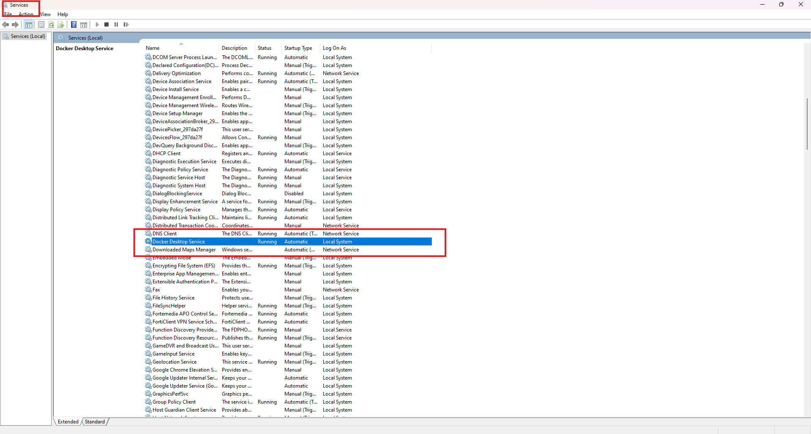
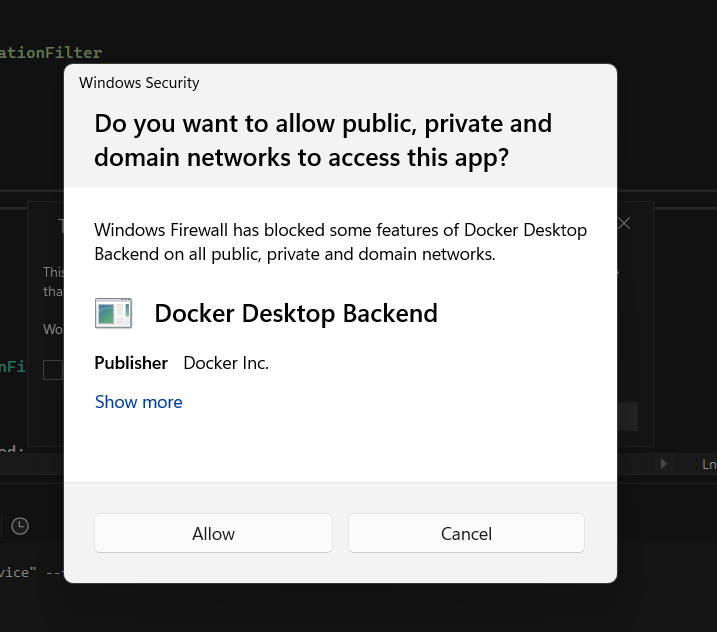

Docker & WSL Installations
===

## Table of Contents

- [Enable permissions for scripts](#enable-permissions-for-scripts)
- [Set up WSL & Docker](#set-up-wsl--docker)
  - [WSL](#wsl)
  - [Docker](#docker)
  - [Windows Firewall](#windows-firewall)
  - [Manual Installation](#manual-installation)

<!-- >Every script needs to be run from the root folder of the application, which is the folder which contains the .sln file(solution file). -->
> #### :heavy_exclamation_mark: **Every script needs to be run from the root folder.**

## Enable permissions for scripts
Before running any scripts, you need to enable the execution of scripts in your powershell. To do this, run the following command in your powershell:

```powershell
Set-ExecutionPolicy -Scope CurrentUser -ExecutionPolicy RemoteSigned
``` 

## Set up WSL & Docker
>**You might be asked for elevated credentials(admin credentials) during installation process for the installation to progress properly.**

### WSL
First, if you do not have WSL(Windows Subsystem for Linux), run the following script from the root folder in powershell like this:


```powershell
.\scripts\setup-wsl.ps1
```

After installing WSL, you will be asked to restart. After restarting, run the following command to install the Linux distribution:

1. Update WSL:
```powershell
wsl --update
```
2. Install Ubuntu Linux:
```powershell
wsl.exe --install Ubuntu-24.04
```
>During installation, you might be asked to set up a username and password for the Linux distribution you are installing. Set up the username and password using your preferred credentials.

### Docker

Then, if you do not have Docker installed:

1. Download the installer from the link: [How To Install Docker Desktop](https://docs.docker.com/desktop/setup/install/windows-install/) **in the `Downloads`** folder.
2. Then, run the following script from the root folder in powershell like this:
**`Note: It is assumed that are run this script as a non-admin user.`**

```powershell
.\scripts\setup-docker.ps1 -UserToAdd (whoami)
```

>**You might be asked to restart the OS after running the script. It is recommended that you restart and then run the remaining scripts and set-up.**


Make sure to enable the Windows Priviliged Helper Service - which is a Windows service used by Docker - if it is not already enabled and running, by checking identified option in Docker Desktop:


You should also make the service startup Automatic (if it is not already) from the following menu in Windows:



Type `Services` in the windows search bar to navigate to this window.


### Windows Firewall
You might get prompts like this to allow Docker to enable network accesses. Click 'Allow' in these situations.



---

### Manual Installation

Refer to the following if you want to set up WSL and Docker yourself:

[WSL Installation](https://learn.microsoft.com/en-us/windows/wsl/install-manual)
[Docker Installation](https://docs.docker.com/desktop/setup/install/windows-install/)
